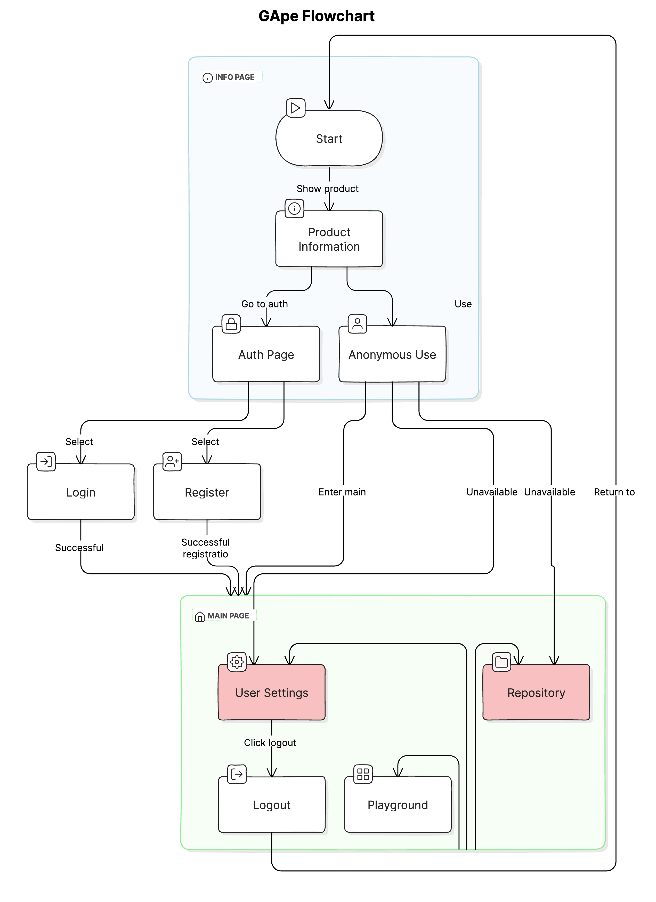

# GApe

GApe (Get A Page Easily), an interactive design tool for creating one-page content such as a curriculum vitae or leaflets for both personal and commercial use.

## Run

- Before Running

```bash
npm i
```

- Debug Mode

```bash
npm run dev
```

- Build

```bash
npm run build
```

## Interface Previews

Todo

## System Flow



## Contribution

### Conventional Commits

Based on:
- [Conventional Commits](https://www.conventionalcommits.org/en/v1.0.0/)
- [@commitlint/config-conventional](https://github.com/conventional-changelog/commitlint/tree/master/%40commitlint/config-conventional)
- [Angular convention](https://github.com/angular/angular/blob/22b96b9/CONTRIBUTING.md#-commit-message-guidelines)

### Git + Github Work Flow

Create a new branch
```shell
git switch main # make sure you are on the main branch
git pull # keep the main branch up to date
git switch -c branchname # create and switch to a new branch
git push -u origin branchname # publish the new branch to remote
```
After making changes on the new branch
```shell
git add . # stage all the changed files
git commit -m "message" # commit changes
git push # publish the changes to remote
```
Open an pull request on Github

If you want to pull another remote branch that was not created by you
```shell
git fetch origin remotebranchname # get remote branch to local
git switch remotebranchname 
```